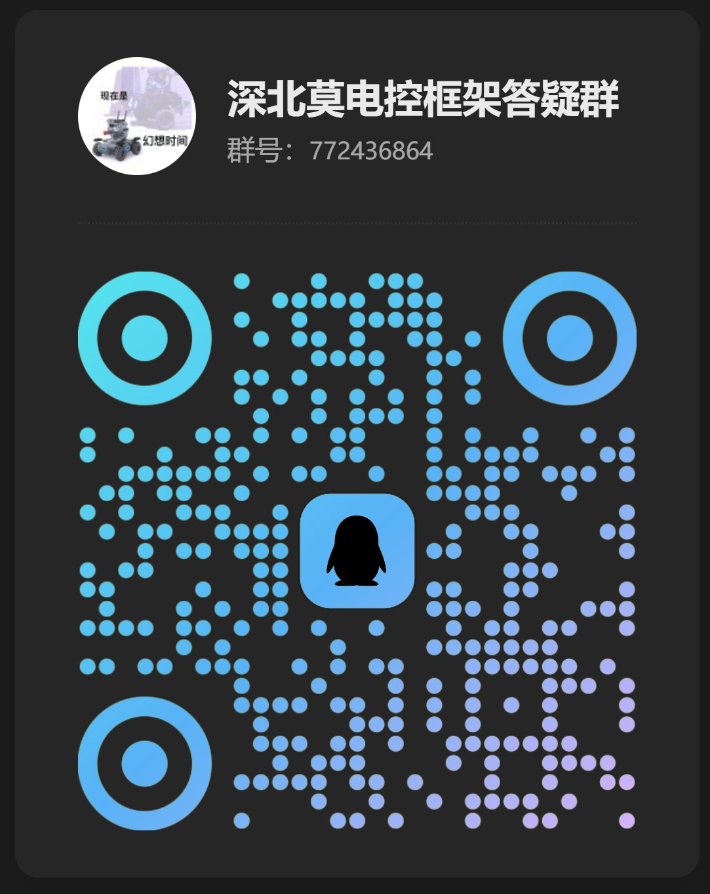

# StandardRobot++

## 简介

> 也许不是最好的？但一定是最适合上手的C板电控框架！

本项目的计划是基于 DJI StandardRobot 的基础上改造成一个更适合北极熊uu们的通用型机器人代码框架。

本框架致力于实现不同类型的机器人的代码通用化，只需要选择底盘云台的类型，修改一下对应物理参数即可实现对机器人的适配。

## 配套套件

- [StandardRobot++ Tool](https://gitee.com/SMBU-POLARBEAR/Serial_Port_Assistant) 上位机调试工具，可用于可视化查看机器人状态及相关参数，便于调试。
- [ROS2_StandardRobot++](https://gitee.com/SMBU-POLARBEAR/ROS2_StandardRobotpp) ROS2驱动包，可用于实现上位机对机器人的控制。

## 模块支持

详细信息请参考 [StandardRobot++ 框架](./doc/framework.md)

### 主要模块

- **Robot cmd**\
  机器人控制模块：
  - [x] 大疆电机
  - [x] 达妙电机
  - [x] 瓴控电机
  - [x] 小米电机
  - [x] 超级电容控制板
  - [x] 板间通信(CAN)
  - [x] PWM 控制舵机
  - [x] PWM 控制气泵
- **Chassis**\
  底盘模块：
  - [x] 麦轮底盘
  - [x] 全向轮底盘
  - [ ] 舵轮底盘
  - [x] 平衡底盘
- **Gimbal**\
  云台模块：
  - [x] yaw-pitch 直连云台
  - [ ] yaw直连-pitch丝杆 云台
  - [ ] yaw-pitch 丝杆云台
- **Shoot**\
  发射机构模块：
  - [x] 摩擦轮+拨弹盘
  - [ ] 摩擦轮+弹鼓+推杆
- **Mechanical arm**\
  机械臂模块：
  - [x] 六自由度直驱机械臂（末端差速）
- **Custom Controller**\
  自定义控制器模块：
  - [x] 六自由度直驱机械臂配套自定义控制器（末端差速）
- **Communication**\
  通信模块：
  - [x] 板间通信(4pin uart2)
  - [x] 上下位机通信
- **Music**\
  音乐模块：
  - [x] 开机声
  - [ ] 报错音
  - [ ] 裁判系统接入提示音
  - [x] 《卡农》
  - [x] 《天空之城》
  - [x] 《恭喜发财》
  - [x] 《好运来》
  - [x] 《See You Again》
  - [x] 《Unity》
  - [x] 《你》

## 开发工具

使用VSCode作为代码编辑器，Keil5作为IDE。
> 虽然keil5老，但在嵌入式调试以及环境配置方面是非常简单易上手的。**千万不要用keil5来编辑代码！！！**
\
\
> VSCode作为现代化代码编辑器 ，通过各种插件即可实现各种提高效率的开发方式，**尤其是Github Copilot**

`.vscode` 文件夹已经提供了很多非常好用的插件，在`扩展`页面输入 `@recommended` 即可获取这些插件，点击安装即可。

## 欢迎贡献

如果你发现了本项目中的问题和可优化的点，可用创建issue进行讨论。

并且fork本项目后提交pr来贡献你的代码。

我们的管理员审核后会将你的代码合并进来。

> ***贡献代码时请参照 [注意事项](./doc/注意事项.md/#贡献代码) 中的贡献代码部分。***
>
> 编写代码时参考[API](./doc/API.md)

## 开发日志

[LOG.md](./doc/LOG.md) 记录了大家在开发过程中的各种奇思妙想和经验。多翻一翻或许能发现惊喜哦。大家有什么想法也都可以往里面写。

[API.md](./doc/API.md) 为开发过程中所使用的模块接口标准，若在编写代码时发现代码与标准冲突，基于本标准修改代码。

## 后续计划

具体要做的事情在[TODO](./doc/TODO.md)中

## 致谢

感谢各个战队的代码开源，所有本框架涉及到的主要的参考资料位于[reference.md](./doc/reference.md)

## 附录

本文的详细补充内容写在 [附录](./doc/appendix.md) 中。

如发现本项目中的问题，请添加至[问题列表](./doc/questions.md)并与相关负责人联系，如果有解决方案可以提交pull request。

## 通讯信息

- 作者 `小企鹅` 微信：18968748997 QQ：1357482552
- 交流群
  > 
